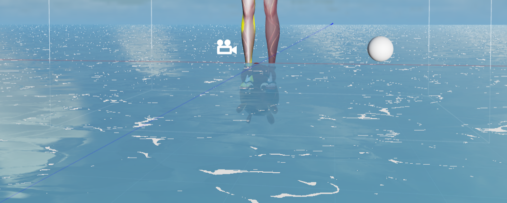

# cocos-effect 简易水面+模型描边（rimlight）
## 水面反射
```
    // normalize the normal vector
    vec3 N = normalize(v_normal);
    vec3 viewDir = normalize(v_position - cc_cameraPos.xyz);
    // vec3 reflectDir = reflect(viewDir, N);
    vec3 reflectDir = (viewDir - 2.0 * dot(viewDir, N) * N) + T * 0.3;
    vec4 reflectColor = texture(reflectTexture, reflectDir);
    // sample fresnel coefficient
    float fresnel = pow(1.0 - dot(N,-viewDir), fresnelPow);

    vec4 col = mainColor * texture(mainTexture, v_uv);
    col.rgb = mix(col.rgb, reflectColor.rgb, reflectCoef * fresnel);
```

### 图片



> 效果图

### 参数

| 项目        | 参数    | 
| --------   | ------   |
| xxx     | 1 | 
| xxx        |  1  | 
| xxx|    1    |

---
